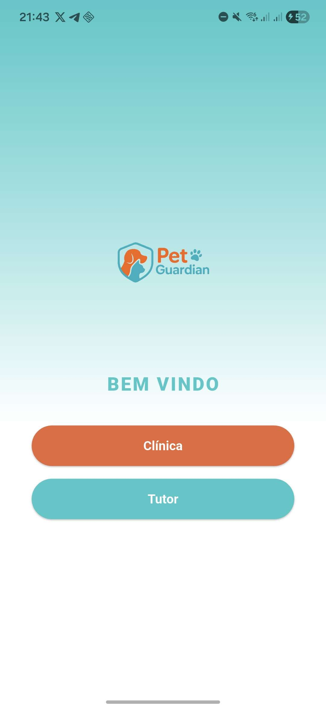
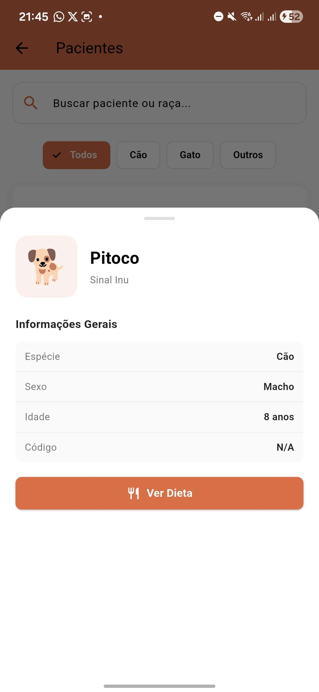
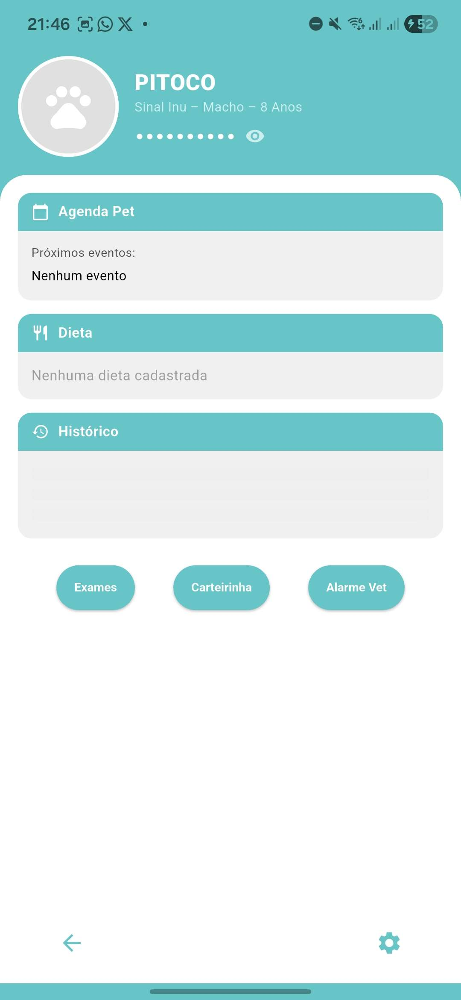
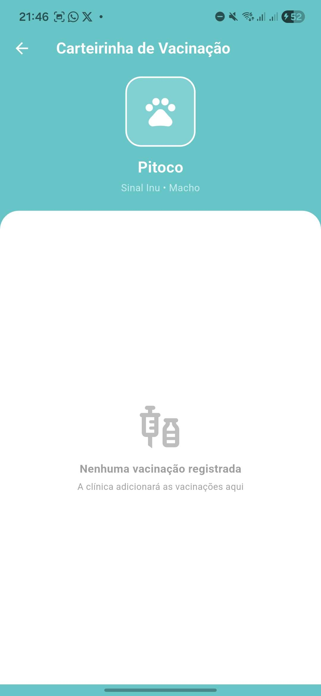

# 🐾 Pet Guardian

Aplicativo Flutter completo para tutores e clínicas veterinárias, com banco de dados SQLite local.

## 📱 Telas Implementadas

| Tela | Descrição |
|------|-----------|
| **Welcome** | Seleção entre Clínica e Tutor |
| **Login** | Email/CNPJ + senha, Google Sign-In placeholder |
| **Cadastro** | Registro de novos usuários |
| **Perfil do Pet (Tutor)** | Tema teal — agenda, dieta, histórico |
| **Perfil do Pet (Clínica)** | Tema laranja — mesma estrutura |
| **Exames Pet** | Lista de exames com add/delete |
| **Alarme Vet** | Lista de alarmes veterinários |
| **Agenda (Clínica)** | Calendário interativo com TableCalendar |
| **Configurações** | Conta, Notificação, Privacidade, Suporte, Sobre |

## 🗄️ Banco de Dados (SQLite)

### Tabelas
- **usuarios** — tutores e clínicas
- **pets** — animais vinculados a tutores
- **exames** — exames do pet
- **alarmes** — alarmes veterinários
- **dietas** — dieta atual do pet
- **agendamentos** — consultas, vacinas e exames agendados

## 🚀 Como Rodar

### Pré-requisitos
- Flutter SDK ≥ 3.0.0
- Android Studio ou VS Code
- Emulador ou dispositivo físico

### Instalação

```bash
# 1. Acesse a pasta do projeto
cd pet_guardian

# 2. Instale as dependências
flutter pub get

# 3. Execute o app
flutter run
```
### Prints Mobile 






## 📦 Dependências Principais

```yaml
sqflite: ^2.3.0          # Banco de dados SQLite
table_calendar: ^3.0.9   # Calendário interativo
intl: ^0.18.1            # Formatação de datas em pt_BR
share_plus: ^7.2.1       # Compartilhar exames/alarmes
flutter_local_notifications: ^16.1.0  # Notificações locais
```

## 🎨 Design

| Tema | Cor | Uso |
|------|-----|-----|
| Tutor | `#3CC8C8` (Teal) | Telas do tutor |
| Clínica | `#E8673A` (Orange) | Telas da clínica |


## ✨ Funcionalidades

- ✅ Login com validação no banco local
- ✅ Perfis separados para Tutor e Clínica
- ✅ CRUD completo de Exames
- ✅ CRUD completo de Alarmes Vet
- ✅ Calendário interativo com ícones por tipo de evento
- ✅ Dados demo pré-carregados
- ✅ Swipe para deletar (Dismissible)
- ✅ Bottom sheets para formulários
- ✅ Navegação bottom bar
- ✅ Datas em português (pt_BR)
- ✅ Gradientes e tema fiel ao Figma
